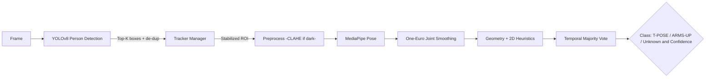

# Pose Estimation Pipeline (YOLOv8 + MediaPipe)

This module detects people and classifies two mission-specific poses — **T-POSE** and **ARMS-UP** — in real time.

---

## ✨ Features

* **Two-Stage Perception:**

  1. **YOLOv8** for robust person detection
  2. **MediaPipe Pose** for landmark extraction + custom geometry-based classification

* **Stability & Accuracy:**

  * ROI stabilization (center/size smoothing)
  * One-Euro filtering on critical joints (shoulders, elbows, wrists)
  * Temporal majority voting (N-frame buffer)
  * CLAHE-triggered local contrast boost for dark ROIs

* **Multi-Target Tracking:**
  Lightweight tracker orchestration with spawn/de-dup/aging logic; supports up to **TOP-K** persons.

* **Performance-First:**
  CUDA-enabled YOLO, OpenCV **custom build (CUDA + GStreamer)**, threading/multiprocessing-friendly, BLAS/OpenMP oversubscription guards.

---

## 🧱 Architecture

---

## ⚙️ Key Parameters (defaults)

> These values were tuned during field testing; adjust them according to your mission.

* **YOLO / Detection**

  * `MODEL_PATH = models/yolov8m.pt`
  * `MIN_YOLO_CONF = 0.55`
  * `TOPK_PERSONS = 2` (mission had 2 mannequins)
  * Dynamic `imgsz`: 448 ↔ 640 (short side threshold = 100 px)

* **ROI & Stabilization**

  * `BBOX_PADDING_BASE = 45`, `BBOX_PADDING_TPOSE = 70`
  * `ROI_SMOOTH_ALPHA = 0.5`
  * `ROI_MAX_CENTER_JUMP_PCT = 0.035`, `ROI_MAX_SIZE_JUMP_PCT = 0.04`

* **MediaPipe Pose**

  * `MP_MIN_DET = 0.60`, `MP_MIN_TRK = 0.50`
  * `MP_MODEL_COMPLEXITY = 1`

* **Joint Smoothing (One-Euro)**

  * Joints: `SMOOTH_IDX = [13,14,15,16]` (elbow & wrist)
  * `FREQ=30.0`, `MINCUTOFF=0.8`, `BETA=0.015`, `DCUT=1.0`

* **Pose Decision**

  * Buffer: `POSE_BUFFER_N = 9`, **stable** ≥ `POSE_STABLE_MIN = 3`
  * Visibility gates: `POSE_MIN_VIS = 0.5`
  * T-POSE: spine–arm angle \~\[70°,115°], elbow ≥ 155°
  * ARMS-UP: arm vertical (spine angle ≤ 45°), elbow ≥ 125°
  * Fusion of geometry + 2D heuristics → final confidence

* **Tracker Lifecycle**

  * Age-out: `TRACK_AGE_MAX = 25` frames
  * De-dup & overlap suppression tuned by IOU and center distance

---

## 🧪 Tuning Cheatsheet

* **Low light / grain:** Increase `CLAHE_LUMA_THRESH` (e.g., 60–70) to strengthen contrast enhancement.
* **Shaky camera / motion:** Decrease `ROI_SMOOTH_ALPHA` (\~0.45) and `ROI_MAX_*_PCT`.
* **Too many “Unknowns”:** Lower `MP_MIN_DET` to 0.55–0.58; increase `POSE_BUFFER_N`; set `POSE_STABLE_MIN` = 3–4.
* **Confused ARMS-UP vs T-POSE:** Adjust `TPOSE_SPINE_*`, `ARMSUP_SPINE_MAX`, and `*_ELBOW_MIN` thresholds; increase elbow weighting if wrist visibility is low.
* **Overlapping persons:** Tighten `DEDUP_*` and `TRACK_SUPPRESS_*` parameters.
* **Low FPS:** Ensure CUDA is enabled (`DEVICE="cuda:0"`, `HALF=True`).

  * Verify OpenCV was **manually built with CUDA + GStreamer**.
  * For Torch: enable `torch.backends.cudnn.benchmark = True` and `torch.set_float32_matmul_precision('high')`.

---

## 🛠 Runtime & Env Notes

* BLAS/OpenMP oversubscription guards (`OMP_NUM_THREADS`, `OPENBLAS_NUM_THREADS`, …).
* OpenCV:

  * `cv2.setUseOptimized(True)`, `cv2.setNumThreads(0)`, `cv2.ocl.setUseOpenCL(False)`
  * **Custom build with CUDA + GStreamer** (Jetson & Desktop) → significant FPS boost.
* YOLO warm-up & dynamic `imgsz`:

  * Dummy inference on startup warms CUDA kernels.
  * If the short side shrinks below threshold, `imgsz` switches to 640 for better detection.

---

## 📦 Model & Files

* `models/yolov8m.pt` — tuned for person class (id=0)
* Optional: smaller models (s/n) are faster; m/h are more accurate (choose based on GPU).
* Exclude large model files from the repo (use LFS/artifacts).

---

## 🔒 Reliability & Safety

* **Temporal voting** and **ROI stabilization** reduce single-frame errors.
* Operator confirmation (GCS side) always has the final decision; pipeline does not act autonomously.
* Debug mode: failed ROIs are saved to `debug_fails/` for inspection.

---

## 📸 Credits

* Photo: *“Drop to Hand”* — competition shot.
* Stack: Ultralytics YOLOv8, Google MediaPipe, OpenCV (custom CUDA + GStreamer), PyTorch.
